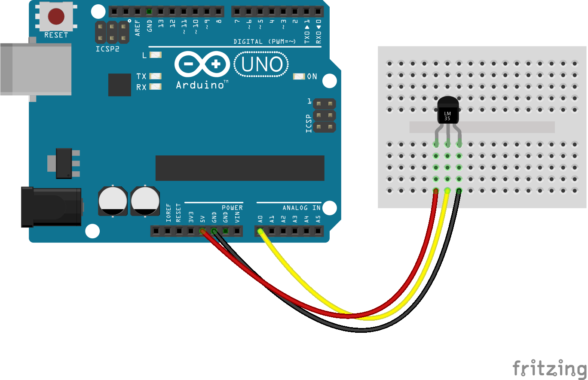

# Sensor de temperatura usando plataforma IOT Wireless Monitor

Aplicativo que utiliza a api do [Wireless Monitor](https://github.com/SanUSB-grupo/wireless-monitor)
para enviar dados de medição de temperatura.

## Configuração

Adicione seu usuário aos grupos `dialout` e `tty`:

```
sudo adduser $(echo $USER) dialout
sudo adduser $(echo $USER) tty
```

Isto irá permitir a execução sem a necessidade de ser superusuário (_root_).

## Montagem do circuito



## Instalação

```
npm install
```

## Execução

Com uma instância do Servidor Wireless Monitor rodando em `http://localhost:8000`,
crie um Monitor de Temperatura, veja suas credenciais (`api_key` e `monitor_key`),
edite o arquivo `index.js` e defina suas credenciais.

Em seguida execute o programa:

```
node index.js
```
